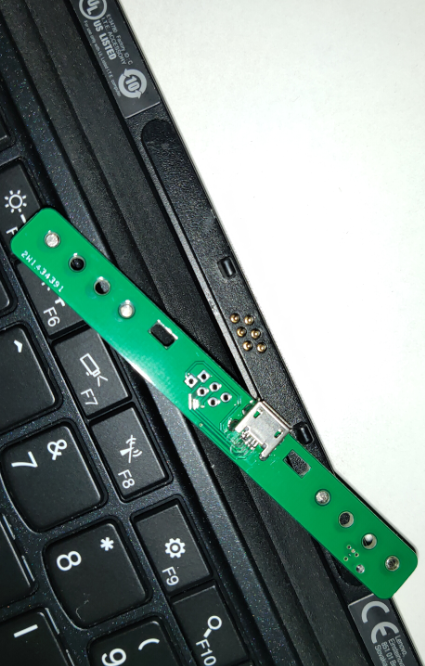
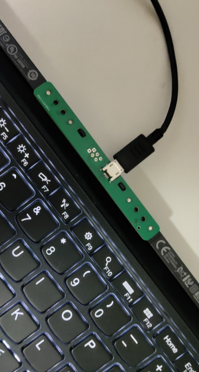

## 这是一个简单的PCB，实现将x1tablet键盘的顶针接口转成microUSB的接口
---
## 

- 安装驱动后，Windows下可以正常使用小红点和触摸板
- 只适用于x1tablet两排顶针接口的键盘
- 项目PCB目录下为PCB与原理图，PCB可直接打印
- 左右各4个开孔，可用AB胶固定磁铁（直径 2mm 磁铁）

--- 
## 成品

---
## 驱动
[触控板 (Trackpoint)] 链接：
https://think.lenovo.com.cn/support/driver/newdriversdownlist.aspx?categoryid=12414&CODEName=&SearchType=1&wherePage=1&SearchNodeCC=&needmt=X1%20Tablet

---
## 其它说明
- 6 pin的接口使用的是AD库中3排针的过孔，孔径正好与弹簧顶针的直径相符合。
- 关于micro USB的id引脚，经过查找资料，id引脚与OTG相关，该引脚此处无用，可以将信号拉低。因此我将id引脚与GND引脚连锡，不接id引脚应该也是可以的